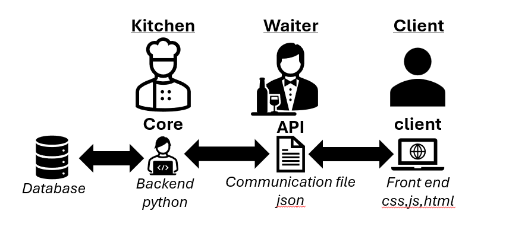

# 💸 Système de Gestion de Budget V4

Une application de gestion financière modulaire développée en **Python/Flask**, utilisant **Pandas** pour le traitement de données et une interface Web moderne (HTML5/JS). L'application se distingue par sa capacité d'analyse prédictive et son architecture découplée.

---

## 🏗️ Architecture du projet



### Structure des dossiers

```
projet/
│
├── _data/                  # Coffre-fort de l'application (base de données)
│
├── core/                   # Cerveau du système
│   ├── models/             # Définition des objets compte et structures de données
│   ├── services/           # Moteurs de calcul (analyseur de cycles, détection de dérives)
│   ├── persistence/        # Gestion des sauvegardes et lectures disque
│   └── variables/          # Référentiels (catégories, labels, constantes système)
│
├── api/                    # Passerelle de communication
│   ├── blueprint/          # Routes Flask découpées par fonctionnalité (Dashboard, Prévision…)
│   └── serializer/         # Traduction des DataFrames Pandas en JSON consommables par le Web
│
└── front_end/              # Interface utilisateur organisée par modules
    ├── compte/
    ├── prevision/
    ├── statistic/
    └── …
```

---

## 🛠️ Fonctionnalités implémentées

### 1. Dashboard central — `/index`

Vue globale de la santé financière.

- **KPIs en temps réel** : revenus, dépenses et solde total agrégés.
- **Graphique d'évolution** : historique des soldes avec sélecteur de période (7j, 30j, Tout).

---

### 2. Gestion granulaire — `/compte`

Manipulation fine des transactions.

- **CRUD intégré** : ajout, suppression et édition de transactions directement dans le tableau.
- **Tri et filtrage** : moteur de recherche par mot-clé et tri par colonne sans rechargement de page.

---

### 3. Intelligence prédictive — `/prevision`

- **Détection de cycles** : identification automatique des revenus et dépenses récurrentes.
- **Stress test** : simulation du pire scénario financier (fourchettes hautes de dépenses, basses de revenus).
- **Seuil de confiance** : curseur interactif (0–100 %) pour ajuster la sensibilité de l'analyseur.

---

### 4. Analyse et intercompte — `/intercompte`

- **Répartition** : visualisation par catégorie sur des périodes personnalisées.
- **Virements internes** : gestion des transferts entre comptes avec suivi de l'impact sur les soldes respectifs.

---

### 5. Objectifs — `/objectif` *(à venir)*

Module de création de projets financiers sans modification de la base de données.

- **Filtrage par date** : définition d'un début et d'une fin de projet.
- **Apprentissage par validation** : l'utilisateur valide une transaction, le système suggère les transactions similaires (empreintes) pour les lier automatiquement à l'objectif.
- **Suivi du reste à financer** : calcul dynamique de l'effort mensuel nécessaire.

---

## 🛡️ Philosophie de la donnée

L'application repose sur le principe de **non-altération** :

> Les fichiers sources dans `_data/` ne sont modifiés que lors d'une **sauvegarde explicite**. Toutes les analyses (prédictions, dérives) sont calculées à la volée pour garantir l'intégrité des données financières.
